# IITG 3D

## ▶ [Play it now, online: no download, no setup](https://claude.ai/artifact/XTPN49amJGjd9xE2xgMJFS)

Click the link and the game opens in your browser (on claude.ai). Use desktop Chrome or Edge for the best result; a phone or tablet works too, with an on-screen joystick. The online copy cannot show the films, YouTube or real websites on the in-game screens and PCs (and may not allow screen sharing): for those, run it on your own computer (see [Play](#play) below).

**An explorable, living IIT Guwahati campus**, rebuilt in 3D from open map, elevation and satellite data.
Walk out of your hostel, queue for lunch in the mess, sit in a lecture, swim in the pool, cycle round the lakes, ride the campus bus, fly a drone over the Brahmaputra. About 3,000 simulated students, staff and families follow a real day: classes, meals, sport, clubs, events and night life.

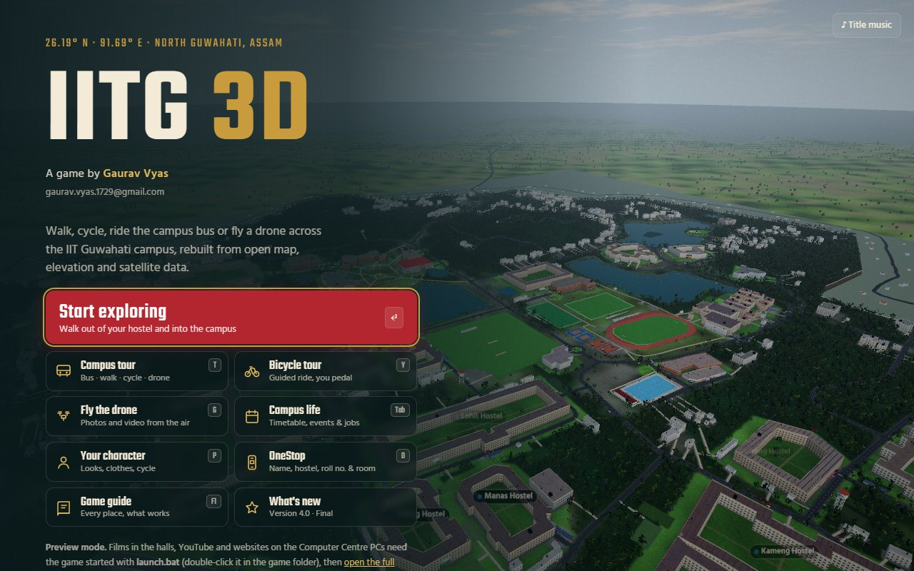

> An unofficial fan project, not affiliated with IIT Guwahati. The crest in the game is an original design, not the institute's emblem, and no company logos are used. Three outlet names (Cafe Coffee Day, Domino's Pizza and KFC) appear as plain-text signs at the places they stand in real life; they are trademarks of their owners and nothing here is endorsed by them.
>
> Made by **Gaurav Vyas** · gaurav.vyas.1729@gmail.com · [MIT licence](LICENSE)

## Play

| How | What to do |
|---|---|
| **Online, nothing to install** | Open **[the online copy](https://claude.ai/artifact/XTPN49amJGjd9xE2xgMJFS)**. Almost everything works; the films, YouTube and real websites on the in-game screens do not (the page it runs in does not allow them), and the presenter PC's Present / share screen may not either. Your progress is saved in that browser. |
| **Windows, everything working** | Double-click **`launch.bat`**. It starts a small local server (needs [Node.js](https://nodejs.org)) and opens the game at `http://localhost:8871/`. Keep its small window open while you play. |
| **Any computer** | Open **`dist/IITG_Campus_3D.html`** in Chrome or Edge (the browsers it is tested in; Firefox and Safari should work but are not tested). It is one file and works offline. |
| **Any computer, with the web features** | `node tools/serve.mjs --open` |

The films on the auditorium and Conference Centre screens, and YouTube and real websites on the in-game PCs, need the local server (`launch.bat`): YouTube refuses to play in a page opened as a plain file, and sites like iitg.ac.in refuse to be shown inside another page. Everything else works from the plain file. If a film or a YouTube tab will not play, the presenter PC's **Present / share screen** button puts any window or browser tab of your own computer on the big screen (it needs a browser that allows screen sharing; an online preview may not).

You need a browser with WebGL 2 and a reasonable graphics card (a laptop GPU is fine; pick **Low / Medium / High** in the menu; **Show frame rate** in the same place tells you how smooth it runs). The game keeps itself smooth on a slower computer by drawing far things nearer first, then by making the picture a little less sharp. A phone or tablet works too, with an on-screen joystick.

**Not sure what to do?** Press **F1** for the Game Guide, or **I** anywhere for what the building or thing you are near has and what works.

### The online copy and your own copy: what works where

| | Online copy (the claude.ai link) | On your computer |
|---|---|---|
| Walking, cycling, the bus, the drone, boats, rides | yes | yes |
| Hostels, the mess, OneStop, the gates, jobs, events, weather, music | yes (click once to start the sound) | yes |
| Films on the auditorium and Conference Centre screens | **no** | yes, with `launch.bat` |
| YouTube and real websites on the in-game PCs | **no** | yes, with `launch.bat` |
| Present / share screen at the presenter PC | probably not (the page may block screen sharing) | yes, in Chrome or Edge |
| Works offline | no | yes |
| Your progress | saved in that browser | saved in the browser you opened it in |

Opening `dist/IITG_Campus_3D.html` as a plain file gives the same as the online copy (no films, YouTube or websites) but works offline. The online copy, `launch.bat` and the plain file each keep their own save: to move your progress, use **Menu, Progress and backup, Export backup** in one and **Import backup** in the other.

### If it is not smooth

The game keeps itself smooth: on a slower computer it first draws far trees, signs and props nearer, and only then makes the picture a little less sharp. Turn on **Menu, Display, Show frame rate** to see the frames per second, the time a frame takes and how far the detail has been cut. If it is slow: pick **Low** quality in the same place; close other tabs; and on a laptop with two graphics chips (Intel and NVIDIA or AMD) make sure the browser uses the strong one (Windows Settings, System, Display, Graphics, add your browser, High performance), because the browser often runs on the weak one.

### Getting out of vehicles

Press **E** or the **Get off / Get out** button on the screen. A car or scooter brakes to a stop and lets you out even if you hold the throttle; the e-rickshaw, buggy, auto or taxi you have just left will not pick you up again for a few seconds; in the middle of the lake **E** swims you ashore.

## What is in it

<table>
<tr>
<td width="50%">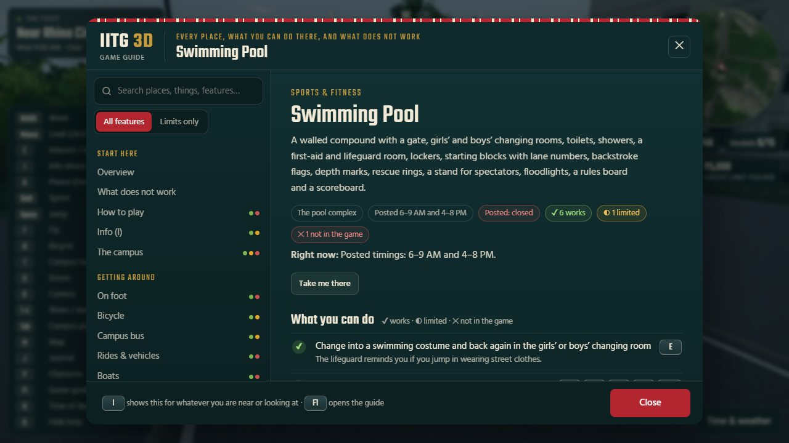<br><b>A Game Guide (F1)</b><br>Every place and thing, what you can do there, and what works only in part or not at all: the swimming pool has changing rooms where you can change, the gym a locker room, and so on for the whole campus.</td>
<td width="50%">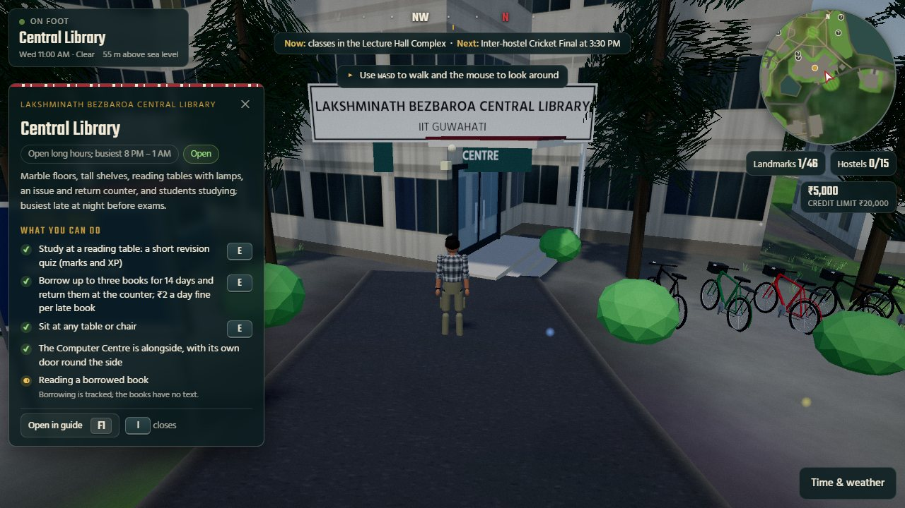<br><b>An Info key (I)</b><br>Press <kbd>I</kbd> next to any building or thing and a panel lists what it has and what you can do there, with what does not work marked.</td>
</tr>
<tr>
<td width="50%">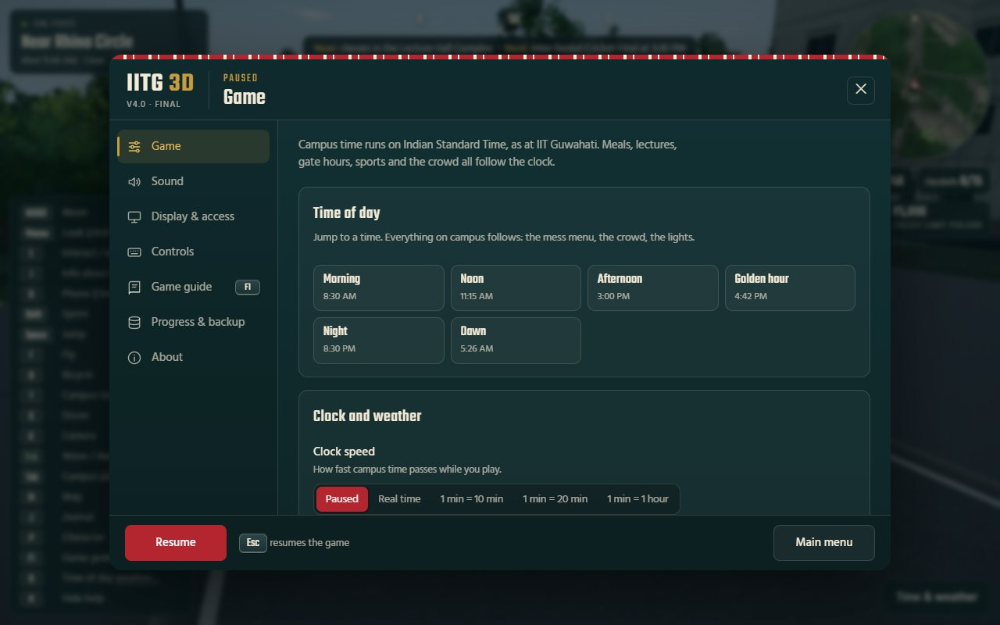<br><b>Menus</b><br>A tabbed menu: game, sound, display and access, controls (the main keys can be rebound), the guide, progress and backup, and about.</td>
<td width="50%">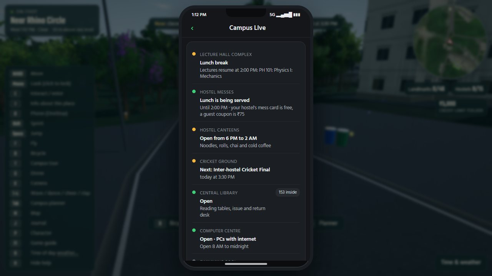<br><b>OneStop, your phone (O)</b><br>Scan in and out at gates and hostel doors, buy mess coupons, see the timetable and Campus Live: what is busy on campus right now.</td>
</tr>
<tr>
<td width="50%">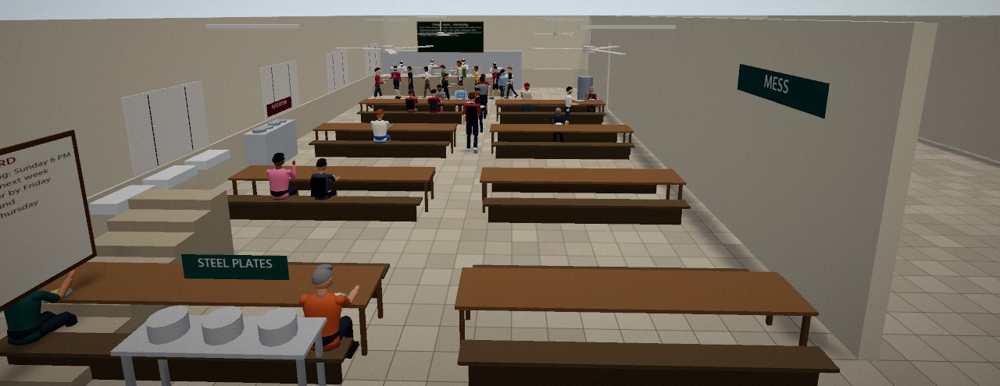<br><b>The hostel mess</b><br>Students pay, take a steel plate, queue at the serving counter, carry the plate to a long table, eat, some go back for more, and return it. You do the same: show your mess card (your own hostel is free) or pay as a guest, hand in the coupon and watch the plate fill.</td>
<td width="50%">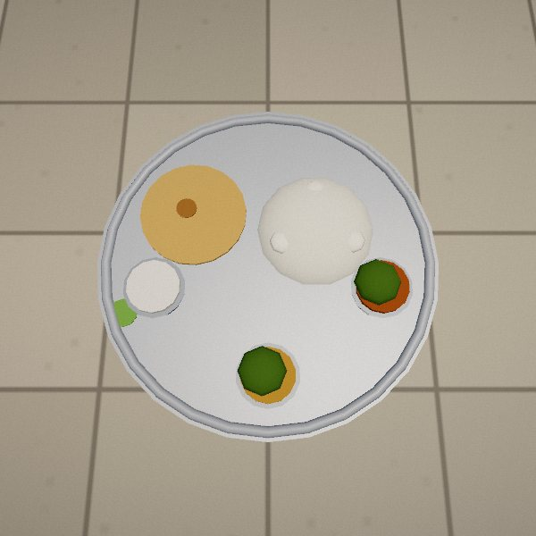<br><b>What is on the plate</b><br>Roti, rice, dal, sabji, curd, salad, papad and a sweet, following the week's menu and Sunday specials.</td>
</tr>
<tr>
<td width="50%">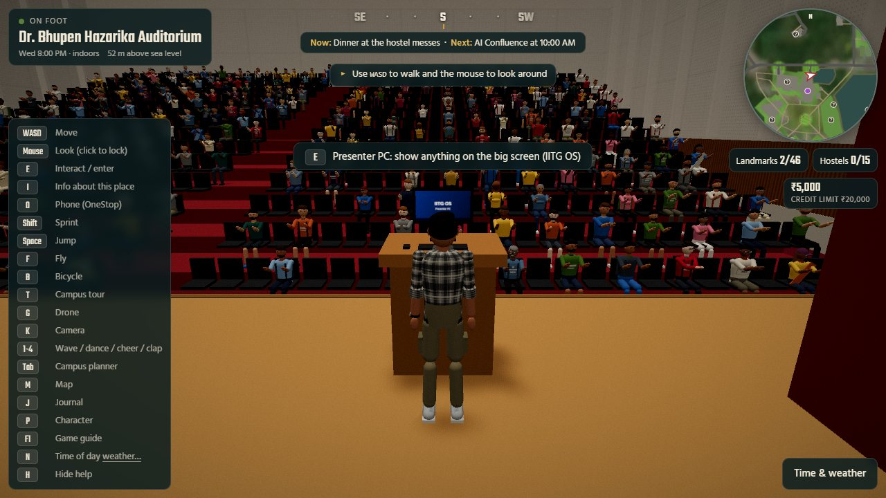<br><b>Present on the big screen</b><br>A presenter PC on the podium of the auditorium and of the Conference Centre. Sign in (user <code>iitg</code>, password <code>iitg</code>) and show anything, or press <b>Present / share screen</b> to put a real window or tab of your own computer on the big screen, as when a laptop is plugged into the projector.</td>
<td width="50%">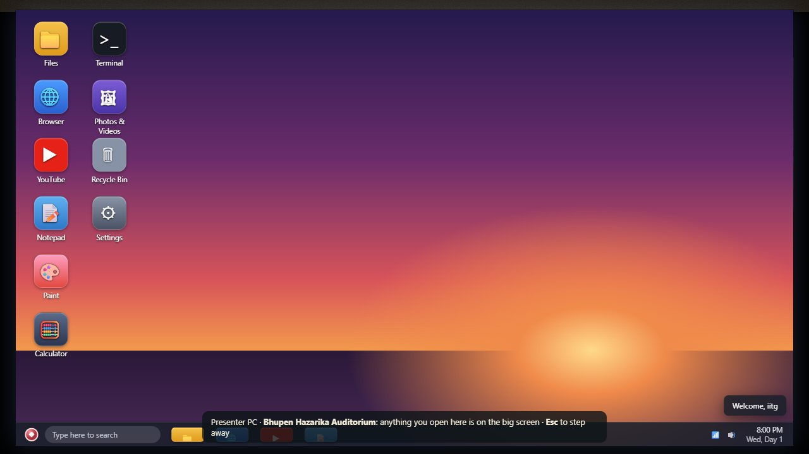<br><b>IITG OS</b><br>A full desktop on the Computer Centre PCs and the presenter PCs: browser, YouTube, files, notepad, paint, calculator, terminal, clock, settings and a game.</td>
</tr>
<tr>
<td width="50%">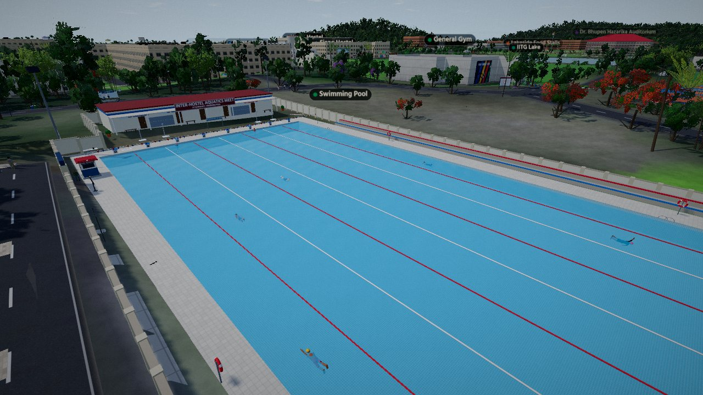<br><b>The swimming pool</b><br>A standard 25 m × 12.5 m pool with six lanes, changing rooms, lockers, showers, a lifeguard, starting blocks, and the inter-hostel aquatics meet.</td>
<td width="50%">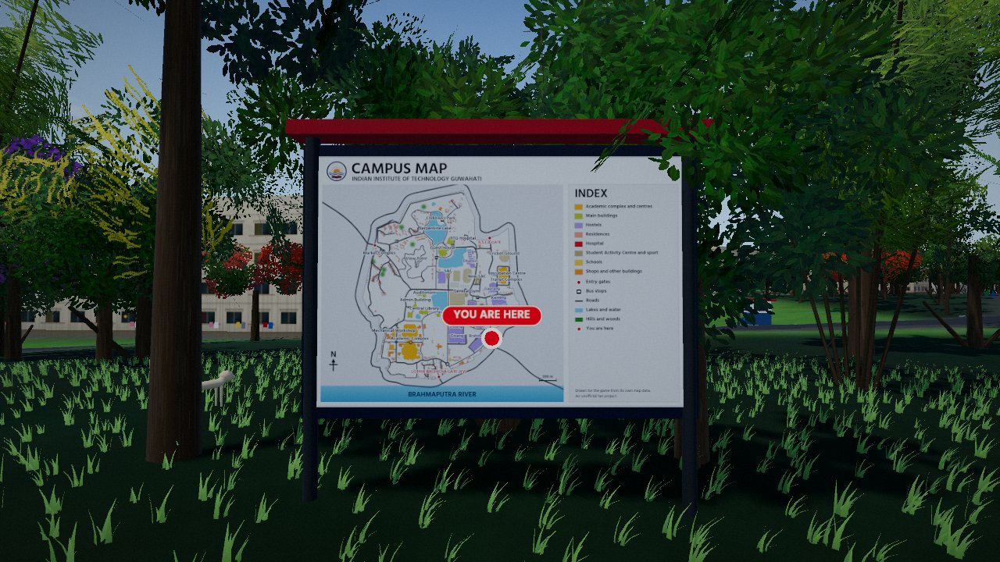<br><b>Campus maps</b><br>“You are here” boards at the gates and big junctions draw the whole campus in the style of a printed campus map.</td>
</tr>
<tr>
<td width="50%">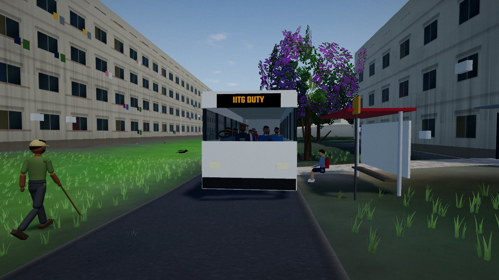<br><b>The IITG DUTY bus</b><br>Ride the campus bus tour from the front seat, or tour on foot, by cycle or by drone: the same stops and stories four ways.</td>
<td width="50%">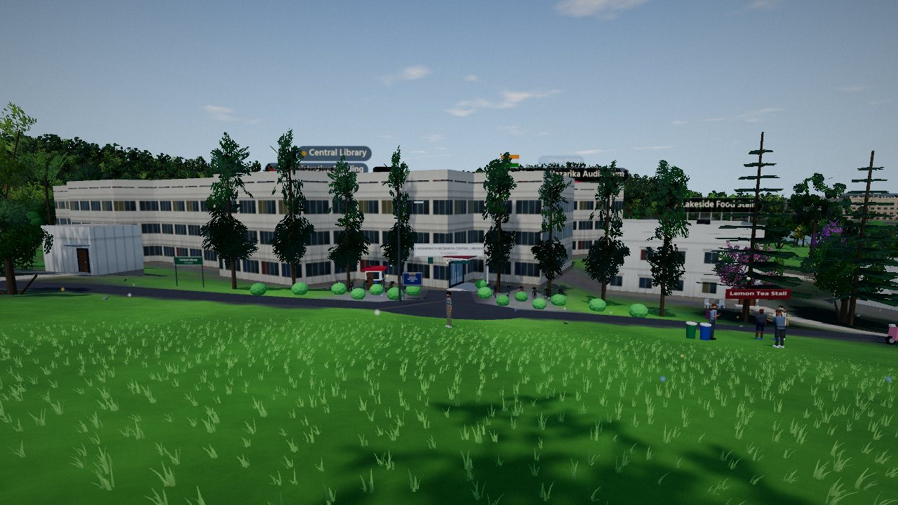<br><b>Mown lawns</b><br>In front of the big buildings, with clipped round shrubs, slim Ashoka trees, a shade tree and a pine.</td>
</tr>
</table>

And more: row a boat on the IITG lake (the only lake with boats); change into gym wear and use the treadmills, bikes and racks of a full gym; borrow library books (late returns are fined); buy medicine at the hospital pharmacy; scan your QR at the desk beside each gate, at the Library, the Computer Centre and the boys' hostels to make your entry (a girls' hostel asks every visitor to sign its register); earn money delivering pizza or driving the ambulance; play football, cricket, tennis, volleyball and basketball; dance and jam at the SAC; take photos and videos; feed the campus dogs.

**The campus, as it looks now.** The main roads where there is room are two-lane roads with a flowered median and a green cycle lane on each side. The Main Gate (with a small brick guard post), the KV Gate (a brown IITG signboard, a cement guard post that was 3D printed, the IIT sub post office built on to its wall; it stands where the road from the circle by the school meets the PWD Road) and the Khokha Gate (two big steel gates of one size, a boundary wall, a gravel path lined with cycles, and the Khokha Chai and Khokha Noodles stalls just outside) are modelled on photographs of the real ones; each has a QR desk beside the road and nothing else. The **IITG Bus Stop** is the terminus every campus bus starts from, next to the **Technology Park** that replaced the east cricket ground. The View Point is on top of the hill at the end of a winding forest trail more than two kilometres long, for people on foot only. The Director's Bungalow is a grand walled house with a fountain, fruit trees and a pool: ask for an appointment at its guard post. The academic lake is fenced and ringed with trees, with benches you can sit on, and the circle beside it is a flower roundabout with the air-quality board, a guard, a bus stop and the duck house. The Academic Complex stands on a podium with a broad flight of stone steps, a portico and a glass entrance bay. The swimming pool is a standard 25 m × 12.5 m pool. Every hostel has a library, a gym, a music room and a TV room on a floor of its own, a wash area with working taps, and its own volleyball court, basketball court and cricket pitch; Domino's Pizza and KFC stand side by side by the Brahmaputra Hostel. Graffiti covers many walls in several styles (a hostel's own walls carry its name and Assam: gamosa, japi, Bihu), and one graffiti wall follows the event that is running. Everyone you talk to has more than a hundred things to say.

Everything the game can do, with what works and what does not, is in **[FEATURES.md](FEATURES.md)**, generated from the same catalogue as the in-game guide.

## Gallery

<table>
<tr>
<td width="50%">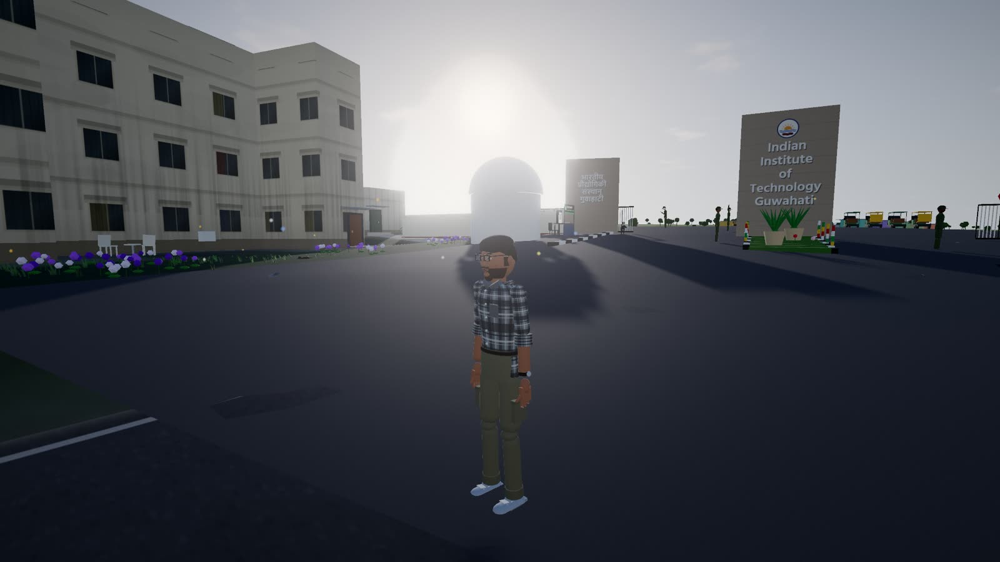<br><sub>The character (the author) on the road in from the Main Gate, at golden hour</sub></td>
<td width="50%">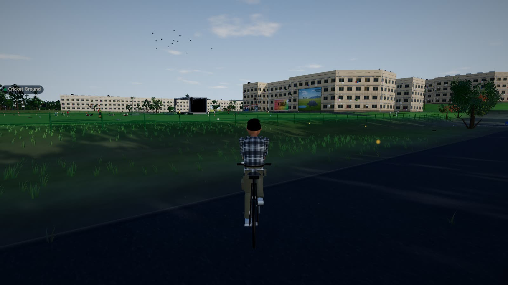<br><sub>Cycling by the IITG lake: the weather and the time of day change as you play</sub></td>
</tr>
<tr>
<td width="50%">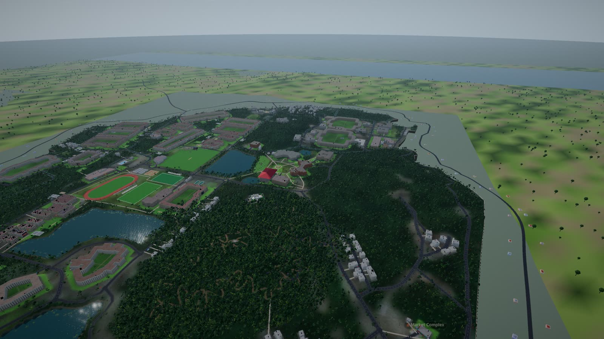<br><sub>The whole campus from the air, with the Brahmaputra beyond</sub></td>
<td width="50%">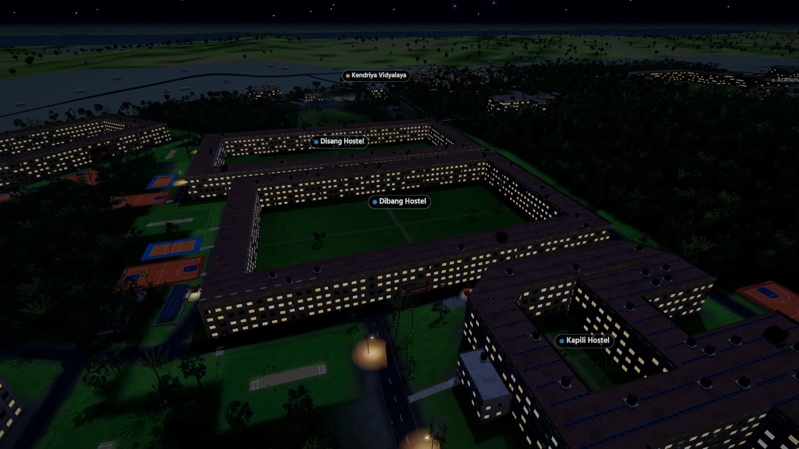<br><sub>The hostel quadrangles at night</sub></td>
</tr>
<tr>
<td width="50%">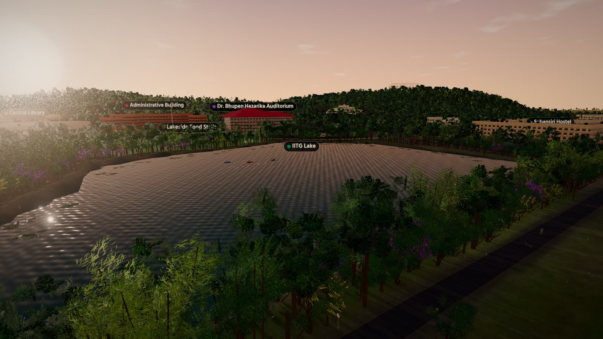<br><sub>The IITG lake and the buildings round it</sub></td>
<td width="50%">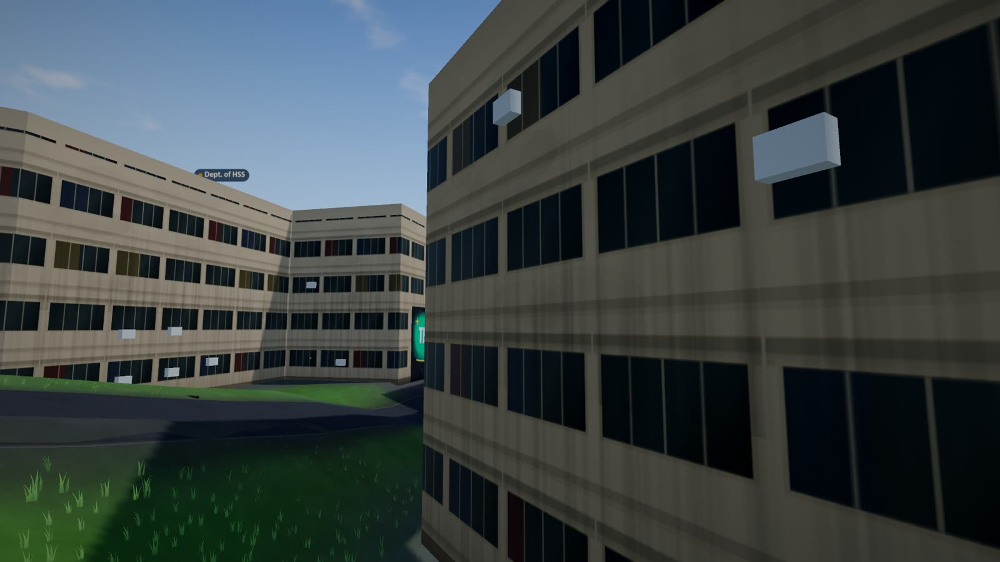<br><sub>The Academic Complex</sub></td>
</tr>
<tr>
<td width="50%">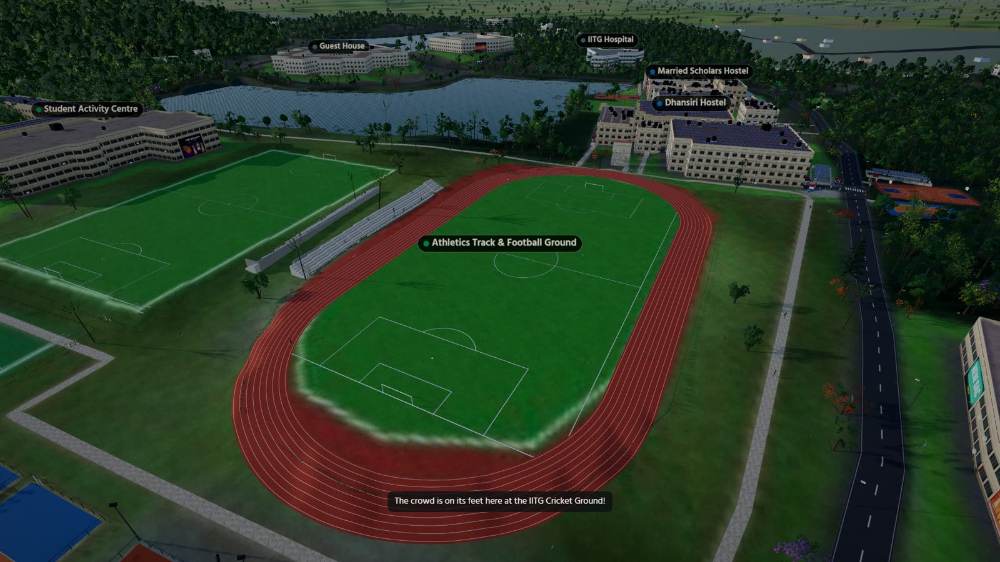<br><sub>The athletics ground with its stands and the courts beside it</sub></td>
<td width="50%">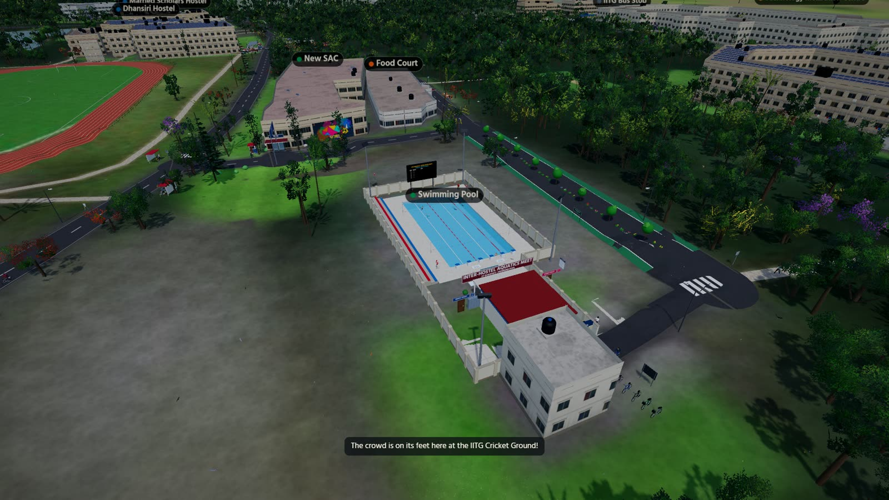<br><sub>The swimming pool compound (a standard 25 m by 12.5 m pool)</sub></td>
</tr>
<tr>
<td width="50%">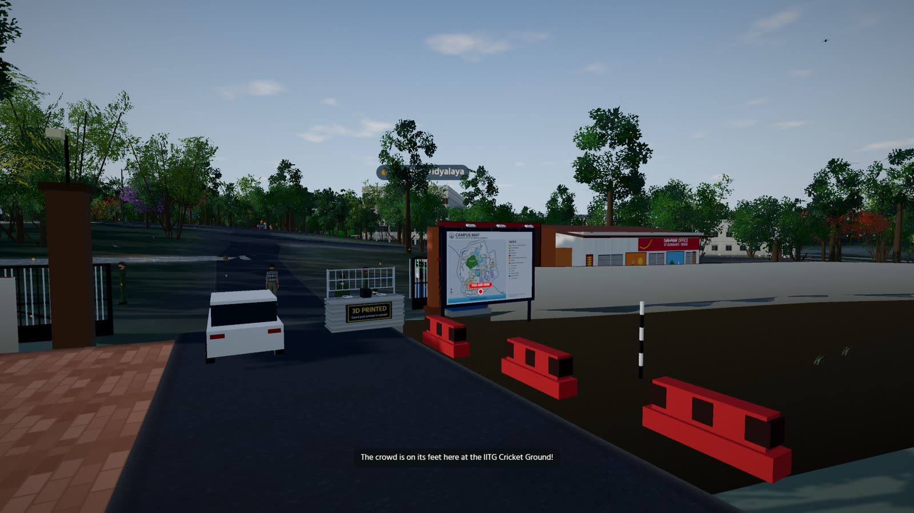<br><sub>The KV (Lothia Baghicha) Gate with its 3D-printed guard post, map board and sub post office</sub></td>
<td width="50%">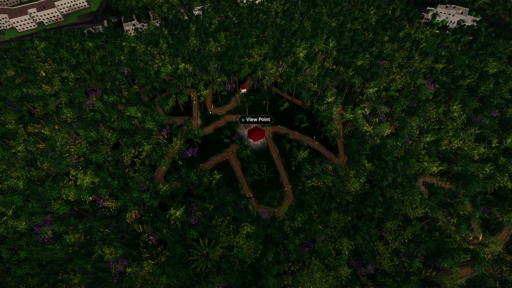<br><sub>The view from the hill</sub></td>
</tr>
</table>

The character in these pictures is the game's default look with the author's name. You make your own in the game (press **P**).

## Controls

| Key | Action |
|---|---|
| `W A S D` / arrows | Move / steer |
| Mouse (click the view first) | Look around; wheel zooms |
| `E` | Use: enter buildings, order food, sit, work, play, talk, borrow a cycle |
| **`I`** | **Info: what the building or thing you are near or looking at has, and what works** |
| **`O`** | **Phone: OneStop (scan in/out, mess coupons, timetable, Campus Live)** |
| **`F1`** | **Game Guide** |
| `Shift` | Sprint / boost |
| `Space` / `C` | Jump or fly up / fly down |
| `F` | Start or stop flying |
| `B` | Get on / off your bicycle |
| `T` | Campus tour: bus, on foot, by cycle or by drone (`[` `]` speed, `X` next stop, `V` view) |
| `Y` | Guided bicycle ride |
| `L` | Race against the clock |
| `G` | Drone (`V` first person / chase, `X` bring it home) |
| `K` | Camera: click for a photo, `R` video, `F` filter |
| `Q` | Show or hide the way to your objective |
| `1` – `4` | Wave, dance, cheer, clap |
| `Tab` | Planner: timetable, events, jobs, money, weather |
| `M` | Campus map (click to travel) |
| `J` | Journal: progress, achievements, your photos |
| `P` | Character creator |
| `N` / `Shift+N` | Next time of day / time and weather controls |
| `Z` | Mute |
| `H` | Hide the key hints |
| `Esc` | Pause menu (game, sound, display, controls, progress and backup, about) |

The main keys (movement, `E`, `I`, `O`, the modes and the panels) can be rebound in the menu. A gamepad is supported (left stick move, right stick look, A interact, X jump, B cycle, Y tour, RB drone, LB camera, LT sprint, RT photo, Start pause).

**Progress and backup.** Your progress (character, level, money, coupons, achievements, settings) is saved in the browser automatically. The Artifact page, `launch.bat` and the plain file each keep their own copy, so *Export backup* in the pause menu saves it to a file and *Import backup* loads it somewhere else.

## A day on campus

| Time | What happens |
|---|---|
| 5 – 9 AM | Dawn and morning: joggers, the gym, the pool from 6, tennis, breakfast **7:30 – 9:30** |
| 9 AM – 5 PM | Lectures Monday to Friday (9 – 1 and 2 – 5) in the Lecture Hall Complex and the Academic Complex; labs; the library, the Computer Centre and the hospital open; the school runs until 1:30 |
| 12:15 – 2 PM | Lunch in the hostel messes, the Food Court and the market busy |
| 4:15 – 7 PM | Sport on every ground and court; the inter-hostel aquatics meet (4 – 7) |
| 5 – 9:30 PM | Club practice at the SAC (dance, music); the week's events (Club Fair, Cricket Final, AI Confluence, Techniche and Alcheringa Pronites, Sports Day, Convocation) |
| 7:45 – 9:45 PM | Dinner; the hostel canteens open **6 PM – 2 AM**; the library and the night canteens fill up |
| After dark | Couples by the lakes, guards on their rounds, jackals and owls; the KV and Khokha Gates close at 10 PM, the Main Gate never does |

## How accurate is it?

The campus itself is built from open data, projected to metres.

| Layer | Source | Notes |
|---|---|---|
| Boundary, roads, footpaths, lakes, sports grounds, names | OpenStreetMap (ODbL) | Names trusted over other sources |
| Building footprints | Overture Maps (OSM + Google Open Buildings + Microsoft ML Buildings) | About 800 buildings; satellite-derived shapes are close but not perfect |
| Building heights | Estimated | OSM floor counts where tagged, otherwise from footprint size |
| Terrain | AWS Terrain Tiles (SRTM / NASADEM, ~30 m) | Real hills (47 – 106 m above sea level) |
| Trees | ESA WorldCover 2021 (10 m) | Trees where satellites see tree cover, none on roads or lake shores; species are representative |
| Ground colour | Sentinel-2 cloudless 2024 by EOX | |
| Roundabouts, bus stands, quarter types, KV, post office, treatment plants | IIT Guwahati campus master plan (2011) and the printed campus map | Registered to the map (median error about 2.4 m on the roads); the plans are not included |
| Gates | Road ends on the campus wall; the KV Gate is the Lothia Baghicha Gate of the campus map, where the road from the circle meets the PWD Road | Main Gate, KV (Lothia Baghicha) Gate, Khokha Gate |

Made up to fill the gaps (close to IITG but not surveyed): the insides of buildings (typical layouts by type), the world outside the wall (ring road, markets, villages, the river), guard cabins, stalls, cycle shops, signs, murals, timetables, menus, prices, people and their routines; the size of the swimming pool (a standard 25 m × 12.5 m, the map only outlines the whole pool area), and the courts, pitches and rooms every hostel has. The in-game guide says what is real and what is not.

## Build from source

The game is plain JavaScript on [three.js](https://threejs.org), bundled into one HTML file with esbuild. Node 18 or newer is enough to build and play.

```
npm install
npm run build          # node tools/build.mjs  ->  dist/IITG_Campus_3D.html
npm run serve          # the local server that launch.bat starts
npm run features       # regenerate FEATURES.md from src/guide/data.js
```

The map data in `data/` is already processed. To rebuild it from the raw downloads (Python 3.11+ with numpy, scipy, shapely, pillow, duckdb, tifffile):

```
rebuild.bat            # reprocess data/raw -> data/, then bundle dist/
rebuild.bat fresh      # also re-download OSM, Overture, elevation, land cover, imagery
```

`dist/artifact.html` (not committed) is the same page without the `<html>/<head>/<body>` wrapper, for sharing as a Claude Artifact; it is not needed to play.

## Tests

```
npm run build
npm test               # everything below, about ten minutes
npm run test:unit      # only the logic tests: a few seconds, no browser
npm run test:play      # only the play-through
npm run screenshots    # retake the pictures in docs/images
```

- **Logic** (`tools/qa/unit-tests.mjs`, 23 tests): vehicle clearance geometry; on the real data the road network, two-lane roads, the View Point trail, the gates and the bus tour (it never clips a building), the swimming pool's size, and the Game Guide catalogue, including that `FEATURES.md` is up to date.
- **Play-through** (`tools/qa/steps.json`, 178 steps): in headless Chrome: walking, cycling, every vehicle, the gates, OneStop, the mess from paying to returning the plate, the halls and presenter PCs (and Present / share screen), the library desk, gym and pharmacy, the pool, every hostel's courts and facilities wing, the wash area's taps, the Lake Circle, the stands, the Academic Complex front, Domino's and KFC, the Game Guide, the Info panel and the menus.
- **Vehicles** (`vehicles.mjs`, 40 checks): you can always get out of a bicycle, scooter or car (even moving, with the throttle held), an e-rickshaw, campus buggy, auto or taxi (stopped or moving, a double press of E, the on-screen Get off button), a boat (even in the middle of the lake: you swim ashore), a bus or a tour.
- **Placement** (`placement.mjs`): nothing stands where it should not: the café, stall counters, the flag bed, traffic islands and every parked cycle.
- **People** (`npc-audit.mjs`): tens of thousands of samples; nobody walks through a building or into water.
- **Drawing budget** (`perf.mjs`): the draw calls and triangles in the busiest views (the first view, the Academic area, the View Point ...) stay under a budget, far trees come in three levels of detail and small far things have a draw distance. Counted, not timed, so it means the same on every computer.

The browser checks need Node 22.12 or newer (for puppeteer-core) and Google Chrome, Chromium or Edge; set `CHROME_PATH` if yours is in an unusual place.

## Project layout

```
src/
  main.js          the game loop, modes and start-up
  menu.js          the pause menu (tabs)            version.js   the version and the author
  guide/           the Game Guide and Info panel: data.js is the catalogue, guide.js the UI
  mess/            the hostel mess: menu and prices, the plate and its food, the queue of students, your side of it
  onestop.js       the OneStop app, its QR machines, the automatic gates and doors      live.js   Campus Live
  scene/           terrain, buildings, roads (dualroads: two-lane roads), water, trees, lawns, props, signs, map boards,
                   gates, pool, courts, roundabouts and the lake circle, murals, stalls, knockable things, cycle shops;
                   acfront (the Academic Complex front), facade (where a name board goes), bungalow, hilltrail (the View Point
                   forest and trail), techpark (the Technology Park and the IITG Bus Stop), concertstage, lakeside ...
  dialogue*.js     what every kind of person says (100+ lines each)
  interiors/       building interiors and their templates (hostel, lecture hall, library, auditorium ...)
  life/ crowd/     the simulated people, animals, traffic and their GPU renderers
  activities/      lectures, exams, study, the library desk, the gym, shopping, sleeping ...
  sports/ events/  matches and the week's events
  os/ pc.js        IITG OS, the desktop on the PCs, and the presenter PCs
  audio.js music.js   the procedural sound and music (no sample files)
  ui.js index.html    the HUD and every overlay
tools/
  build.mjs serve.mjs gen-features.mjs    the bundler, the local server, the FEATURES.md generator
  qa/                                      the tests and the screenshot script
  fetch_*.py process_data.py               download and process the map data
data/              the processed campus model (campus.json, ground image) and the raw downloads
dist/              the playable game
docs/images/       screenshots used in this README
```

## Credits, data licences and notes

Created by **Gaurav Vyas**. Built with three.js (© three.js authors, MIT License); fonts Hind and Teko (SIL Open Font License) from Google Fonts. Music, sound, murals, signs and models were made for the game.

Map data © OpenStreetMap contributors (ODbL). Buildings and places: Overture Maps Foundation (ODbL / CDLA-Permissive-2.0), including Google Open Buildings and Microsoft Building Footprints. Land cover: © ESA WorldCover project 2021 / contains modified Copernicus Sentinel data (2021) processed by the ESA WorldCover consortium (CC BY 4.0). Imagery: Sentinel-2 cloudless, https://s2maps.eu by EOX IT Services GmbH (contains modified Copernicus Sentinel data 2024, **CC BY-NC-SA 4.0**; the ground texture `data/ground.jpg` made from it is shared under the same licence, so it is for non-commercial use). Elevation: AWS Terrain Tiles (Mapzen, SRTM, NASADEM). Films: IIT Guwahati's own videos, streamed through YouTube's embedded player (not copied).

The game's own code is under the **[MIT licence](LICENSE)** (© 2026 Gaurav Vyas). The data licences above apply to the data, and [NOTICE.md](NOTICE.md) lists everything in one place. Because the ground picture is non-commercial, so is the built game.

## Version history

- **4.0 (final), latest**: hostel facilities (library, gym, music room, TV room, wash area with working taps, a volleyball court, a basketball court and a cricket pitch for every hostel; QR at boys' hostels, register at girls'; Assam-themed graffiti); QR-only gate desks beside the road, the Library and the Computer Centre keep QR entry; the KV Gate by the school; Domino's, KFC and Cafe Coffee Day; the Academic Complex's podium, steps and portico; a 25 m × 12.5 m swimming pool; Present / share screen at the presenter PCs; a more detailed character; the Lake Circle roundabout; the concert stage at the other end; walkable stands; cleaner road junctions; bus shelters beside the road; a much lighter and steadier picture (no flicker, adaptive resolution); a Get off button in every vehicle, no instant re-hop into the e-rickshaw you just left, and a swim ashore from mid-lake; a much smoother game (far trees in three levels of detail, a draw distance for small things, the people on the roads drawn by the GPU crowd, shaders compiled behind the loading screen, and a frame-rate counter in the Display settings).
- **4.0 (final)**: the Game Guide (F1) and the Info key (I); new tabbed menus; the hostel mess with its queue, coupons and plates; Campus Live and guest coupons in OneStop; presenter PCs in the halls; IITG DUTY buses; campus map boards; mown lawns; library desk, gym locker room and treadmill, hospital pharmacy; more knockable things and seats; a quiet campus with new music; buses that never clip a hostel; a safer local server; many fixes.
- **3.3**: OneStop, the campus entry app; automatic gates; hostel visiting rules; lake life; the KV Gate; Google search in the in-game PC.
- **3.2**: IITG OS on the Computer Centre PCs; the pool complex; QR entry machines; hostel roofs; camera and downloads.
- **3.1**: murals, the master-plan roundabouts and bus stands, films in the halls, money in rupees, the View Point.
- **3.0 and earlier**: the living campus (people, traffic, sport, events, jobs, wildlife, tours) on top of the first explorable map.
